# 🌟 Astronomy Research Assistant

> **Leveraging the power of Model Context Protocol (MCP) to build an advanced Astronomy Research Assistant with multi-LLM support and comprehensive astronomical data access.**

[](https://www.python.org/downloads/)
[](https://modelcontextprotocol.io/)
[](https://opensource.org/licenses/MIT)
[](https://github.com/topics/astronomy)

## 🚀 Overview

The Astronomy Research Assistant is a sophisticated AI-powered tool that combines the **Model Context Protocol (MCP)** with professional astronomical databases and APIs. It provides researchers, educators, and astronomy enthusiasts with intelligent access to vast astronomical datasets through natural language interactions.

### ✨ Key Features

- 🤖 **Multi-LLM Support**: Works with OpenAI GPT, Anthropic Claude, and local HuggingFace models
- 🔭 **Professional Data Access**: Integration with NASA APIs, SIMBAD, NASA Exoplanet Archive, and more
- 🛠️ **MCP Architecture**: Built on the Model Context Protocol for seamless tool integration
- 🌍 **Real-Time Data**: Live tracking of ISS, Mars weather, Near Earth Objects, and space missions
- 📊 **Educational Tools**: Interactive calculators and constellation information
- 🎯 **Intelligent Tool Selection**: Automatically chooses relevant tools based on query context
- ⚡ **GPU Acceleration**: Optimized local model inference with CUDA support

## 🏗️ Architecture

```mermaid
graph TB
    User[👤 User Query] --> Assistant[🤖 Multi-LLM Assistant]
    Assistant --> MCP[📡 MCP Client]
    MCP --> Server[🛡️ Astronomy MCP Server]
    
    Server --> NASA[🚀 NASA APIs]
    Server --> Astro[🔭 Astroquery/Astropy]
    Server --> Weather[🌤️ Weather APIs]
    Server --> Space[🛰️ Space APIs]
    
    NASA --> APOD[Astronomy Picture of the Day]
    NASA --> NEO[Near Earth Objects]
    NASA --> Mars[Mars Weather]
    
    Astro --> Exoplanets[Exoplanet Database]
    Astro --> Stars[SIMBAD Star Data]
    Astro --> Images[Sky Images]
    
    Space --> ISS[ISS Tracking]
    Space --> SpaceX[SpaceX Launches]
```



## 🛠️ Installation

### Prerequisites

- **Python 3.10+**
- **pip** package manager
- Optional: **CUDA** for GPU acceleration (local models)

### Quick Start

1. **Clone the repository:**
   ```bash
   git clone https://github.com/shitijseth/Astronomy-Research-Assistant.git
   cd Astronomy-Research-Assistant
   ```

2. **Install dependencies:**
   ```bash
   pip install -r requirements.txt
   ```

3. **Set up API keys** (optional but recommended):
   ```bash
   # For enhanced functionality
   export NASA_API_KEY="your_nasa_api_key"
   export OPENAI_API_KEY="your_openai_key"
   export ANTHROPIC_API_KEY="your_anthropic_key"
   export OPENWEATHER_API_KEY="your_weather_key"
   ```

4. **Run the assistant:**
   ```bash
   python assistant_agent.py
   ```

### Alternative: Docker Setup

```bash
# Build and run with Docker
docker build -t astronomy-assistant .
docker run -it --env-file .env astronomy-assistant
```

## 🎯 Usage Examples

### Basic Interactions

```python
# Start the assistant
python assistant_agent.py

# Example queries:
"Show me today's astronomy picture from NASA"
"Find potentially habitable exoplanets"
"What's the current weather on Mars?"
"Where is the International Space Station right now?"
"Calculate my weight on Jupiter if I weigh 70kg on Earth"
"Tell me about the constellation Orion"
"When is the next SpaceX launch?"
```

### Advanced Features

```python
# Switch between different LLM providers
switch 2  # Switch to Claude
providers  # List available providers

# Access professional astronomical data
"Search for exoplanets discovered in 2023"
"Get information about the star Betelgeuse"
"Show me recent Near Earth Object approaches"

# Educational calculations
"How long does light take to travel from Proxima Centauri?"
"What would I weigh on different planets?"
```

## 🔧 Available Tools

### 🌌 NASA & Space Agencies
- **APOD**: Astronomy Picture of the Day with metadata
- **NEO Tracking**: Near Earth Objects and potential hazards
- **Mars Weather**: Real-time weather data from Mars missions
- **ISS Location**: Live International Space Station tracking

### 🔭 Professional Astronomy
- **Exoplanet Search**: NASA Exoplanet Archive with advanced filtering
- **Stellar Data**: SIMBAD database queries for star properties
- **Sky Imaging**: Astronomical object images via SkyView
- **Observing Conditions**: Weather data for astronomy sites

### 🚀 Space Missions
- **SpaceX Launches**: Recent and upcoming launch information
- **Mission Updates**: Current space mission status and data

### 📚 Educational Tools
- **Planet Weight Calculator**: Gravity comparisons across celestial bodies
- **Light Travel Calculator**: Astronomical distance visualization
- **Constellation Guide**: Star maps and mythology information

## 🧪 Testing

Comprehensive test suite included to verify all functionality:

```bash
# Run all tests
python test_mcp_server.py

# Quick tests only
python test_mcp_server.py --quick

# Verbose output with API responses
python test_mcp_server.py --verbose

# Test with real API keys
python test_mcp_server.py --verbose --api-keys
```

### Test Coverage
- ✅ MCP Protocol Implementation
- ✅ NASA API Integration
- ✅ Multi-LLM Provider Support
- ✅ Error Handling & Edge Cases
- ✅ Performance & Concurrency
- ✅ Professional Astronomy Libraries

## 📋 Requirements

### Core Dependencies
```
mcp>=1.0.0
fastmcp>=0.1.0
requests>=2.31.0
pandas>=2.0.0
numpy>=1.24.0
```

### Astronomical Libraries
```
astroquery>=0.4.6  # Professional astronomy databases
astropy>=5.3.0     # Astronomical calculations
matplotlib>=3.7.0  # Plotting and visualization
```

### LLM Providers (Choose based on needs)
```
openai>=1.0.0      # OpenAI GPT models
anthropic>=0.8.0   # Anthropic Claude models
transformers>=4.35.0  # HuggingFace local models
torch>=2.0.0       # PyTorch for local inference
```

See [`requirements.txt`](requirements.txt) for complete dependency list.

## 🔑 API Keys & Configuration

### Required APIs (Free tiers available)
- **NASA API**: [Get your key](https://api.nasa.gov/) (Free)
- **OpenWeather API**: [Get your key](https://openweathermap.org/api) (Free tier)

### Optional LLM APIs
- **OpenAI**: [Get your key](https://platform.openai.com/api-keys) (Paid)
- **Anthropic**: [Get your key](https://console.anthropic.com/) (Paid)

### Environment Variables
```bash
# Create .env file
NASA_API_KEY=your_nasa_api_key
OPENWEATHER_API_KEY=your_weather_key
OPENAI_API_KEY=your_openai_key
ANTHROPIC_API_KEY=your_anthropic_key
```

## 🏎️ Performance Features

### GPU Acceleration
- **CUDA Support**: Automatic GPU detection for local models
- **FP16 Optimization**: Memory-efficient inference
- **Model Caching**: Faster subsequent inferences

### Concurrent Processing
- **Async Architecture**: Non-blocking API calls
- **Connection Pooling**: Efficient resource management
- **Error Recovery**: Graceful handling of API failures

## 🤝 Contributing

We welcome contributions! Here's how to get started:

1. **Fork the repository**
2. **Create a feature branch**
   ```bash
   git checkout -b feature/amazing-feature
   ```
3. **Make your changes**
4. **Add tests** for new functionality
5. **Run the test suite**
   ```bash
   python test_mcp_server.py --verbose
   ```
6. **Submit a pull request**

### Development Setup
```bash
# Install development dependencies
pip install -r requirements.txt
pip install pytest black flake8 mypy

# Run code formatting
black *.py

# Run linting
flake8 *.py

# Run type checking
mypy *.py
```

## 📖 Documentation

### Code Structure
- `assistant_agent.py` - Main assistant with multi-LLM support
- `astronomy_mcp_server.py` - MCP server with astronomical tools
- `test_mcp_server.py` - Comprehensive test suite
- `requirements.txt` - Python dependencies

### Key Classes
- **`AstronomyAssistant`** - Main assistant orchestrator
- **`LLMProvider`** - Abstract base for LLM integrations
- **`MCPServerTester`** - Testing framework for MCP tools

## 🌟 Use Cases

### 🎓 Education
- **Astronomy Courses**: Interactive learning with real data
- **Student Projects**: Access to professional databases
- **Homework Help**: Calculations and explanations

### 🔬 Research
- **Data Exploration**: Quick access to astronomical catalogs
- **Observation Planning**: Weather and visibility conditions
- **Literature Review**: Current space mission updates

### 🏠 Amateur Astronomy
- **Stargazing**: Object information and visibility
- **Astrophotography**: Target selection and conditions
- **Space Tracking**: ISS passes and satellite visibility

## 🔮 Roadmap

### Version 2.0 (Planned)
- [ ] **Web Interface**: Browser-based UI with FastAPI
- [ ] **Voice Commands**: Speech recognition integration
- [ ] **Observation Planner**: Automated scheduling tools
- [ ] **Social Features**: Share discoveries and observations
- [ ] **Mobile App**: iOS/Android companion app

### Integration Targets
- [ ] **Jupyter Notebooks**: Interactive research environment
- [ ] **Slack/Discord Bots**: Community integration
- [ ] **Home Assistant**: Smart home astronomy automation
- [ ] **ASCOM Drivers**: Direct telescope control

## 🐛 Known Issues

- **SpaceX API**: Occasional rate limiting (see [#12](https://github.com/shitijseth/Astronomy-Research-Assistant/issues/12))
- **Mars Weather**: Historical data gaps due to mission cycles
- **Local Models**: High memory usage on CPU-only systems

## 📄 License

This project is licensed under the MIT License - see the [LICENSE](LICENSE) file for details.

## 🙏 Acknowledgments

- **Anthropic** for the Model Context Protocol specification
- **NASA** for providing free access to astronomical APIs
- **Astropy Community** for professional astronomy tools
- **OpenAI & Anthropic** for LLM API access
- **Space-Track.org** for satellite tracking data

## 📞 Support

- 🐛 **Issues**: [GitHub Issues](https://github.com/shitijseth/Astronomy-Research-Assistant/issues)
- 💬 **Discussions**: [GitHub Discussions](https://github.com/shitijseth/Astronomy-Research-Assistant/discussions)
- 📧 **Email**: [Contact the maintainer](mailto:your-email@example.com)
- 🌟 **Star the repo** if you find it useful!

## 📊 Statistics


---

<div align="center">
  <h3>🌌 Explore the Universe with AI 🌌</h3>
  <p><em>Built with ❤️ for the astronomy community</em></p>
  
  **[⭐ Star this repo](https://github.com/shitijseth/Astronomy-Research-Assistant) • [🐛 Report Bug](https://github.com/shitijseth/Astronomy-Research-Assistant/issues) • [💡 Request Feature](https://github.com/shitijseth/Astronomy-Research-Assistant/issues/new)**
</div>
